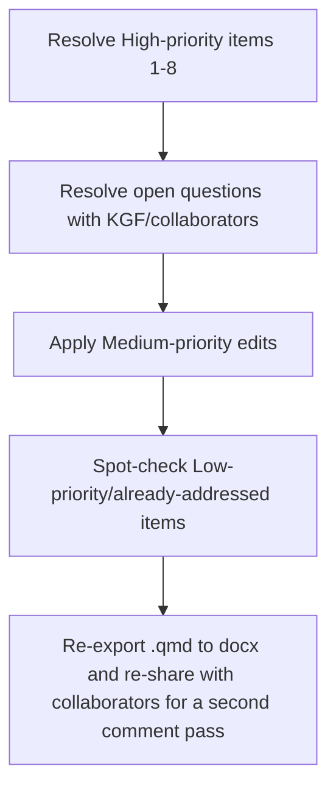

# Revision Plan — KGF Comments (2026-02-10)

Source comment file: `manuscript/Aponte_Bolivar_endophytes_mimulus_manuscript_KGFcomments_20260210.html` Source manuscript: `Aponte_Bolivar_mim2_manuscript.qmd`

This document inventories every comment left in the annotated HTML, maps it to the corresponding passage in the current `.qmd`, and gives each one a status and priority so you can work through revisions systematically with your collaborators. It is a planning artifact — no manuscript prose has been changed yet.

## How to use this

- Work top to bottom within a section, or tackle the **High** priority rows first across all sections.
- "Status" reflects the *current* `.qmd` text as of this writing, checked against the anchored comment text.
- Where a comment implies deeper explanatory work (not just a wording tweak), it's called out explicitly in the "Depth needed" column and unpacked in the narrative below.

------------------------------------------------------------------------

## 1. Comment inventory

### Abstract / research questions

| ID | Anchored text | Ask | Status | Priority | Depth needed |
|------------|------------|------------|------------|------------|------------|
| FKG1 | "Q2) How do traits and FEF communities change across elevation..." | Flag on research-question framing | Q2/Q3 wording in Abstract matches Intro Q1–Q4 as currently written | Low | No — just confirm consistency |
| BAR7 | "Q1) Are there differences in leaf functional traits..." | Question numbering/organization check | Consistent across Abstract/Intro | Low | No |

### Introduction

| ID | Anchored text | Ask | Status | Priority | Depth needed |
|------------|------------|------------|------------|------------|------------|
| KF2 | "The patterns observed in this model system encourage testing these hypotheses..." | Affirms broader-relevance framing | Present, line 116 | Low (done) | No |
| KF3 | Citation check on McIntosh et al. 2024 | Confirm citation | Present in Methods/Discussion; cited in Intro line 118 | Low (done) | No |
| **FKG4** | "M. guttatus (CITATION)" — AMF association | **Missing citation** for the claim "arbuscular mycorrhizal fungi (AMF) are known to associate with *M. guttatus*" (line 118) | **Not addressed** — line 118 still has no citation after this sentence | **High** | Needs a real citation (likely an AMF/*Mimulus* root-symbiosis paper) — flag as a literature-search task, not just a formatting fix |
| KF_6 | "However few studies have examined the effect of both host species and environmental variation on FEF community composition." | Added content on knowledge gap | Present, folded into line 120 ("To our knowledge, no previous studies...") | Low (done) | No |
| FKG5 | "To our knowledge, no previous studies have considered symbionts in leaf tissue of *Mimulus*..." | Editorial streamlining | Present at line 120, reads cleanly | Low (done) | No |
| FKG8 | Q3 wording: "leaf traits" struck, "species" inserted | **Clarify whether Q3 is about species or leaf traits** | Current Q3 (line 122): "To what extent do leaf traits and elevation explain variation in FEF richness, diversity, composition, and community structure across individuals and species?" — this already blends both "leaf traits" and "species" | **Medium** | This looks like it may already have been revised to include both terms, but re-confirm with KGF whether this fully resolves her concern or if the phrase is now overloaded (four things — traits, elevation, structure, and species — asked in one sentence) |
| FKG9, FKG11 | General comments on Q1–Q4 framework and predictions wording | Structural/wording | Q1–Q4 present in both Abstract and Intro; predictions paragraph present (line 122) | Low | No |
| KF_10 | Nicotra et al. 2011 citation addition (leaf lobing) | **Add citation** | `@nicotra2011` already appears in reference list and is cited multiple times, including near leaf-shape/lobing discussion (line 122, 248) | Low (done) | No |

### Methods

| ID | Anchored text | Ask | Status | Priority | Depth needed |
|------------|------------|------------|------------|------------|------------|
| KF12 | "Materials and Methods" heading | Structural comment on heading | Present as-is | Low | No |
| **KF13** | "on all \_\_\_\_\_ field collected specimens" | **Missing information** — a blank/placeholder needing a specific number or clarification of which specimens received trait measurements | Current text (line 135) states "We collected between 5 - 20 individuals per species from a total of 25 sites" and (line 139) "We removed all healthy leaves (\~5-10)... took three measurements per trait from three haphazardly selected leaves from individual plants" — **no explicit blank remains in the current .qmd**, but it's not stated whether *every* collected specimen received trait measurements, or only a subset | **High** | Needs an explicit sentence: state total N of specimens with complete trait data, and whether trait measurement was attempted on 100% of collected plants or a subsample. The Statistical Analyses section reports specific PCA n (line 163) that could be pulled forward into Methods for clarity |
| BAR14 | "343 (including 27 controls) libraries...two separate sequencing runs" | Comment/clarification | Present, line 153, matches | Low (done) | No |
| KF15 | "151 samples" (filtering step) | Quantitative detail confirmation | Present, line 155 | Low (done) | No |
| KF16 | Cross-reference "Q1 and Q2" | Link statistical test to research questions | Present, line 163 ("to answer the first portion of Q1 and Q2") | Low (done) | No |
| KF17 | "After which we were left with 84 samples" | Rarefaction clarification | Present, line 200 (Results, not Methods) — worth double-checking this number matches the Methods description of the rarefaction pipeline (line 167, which reports `r ncol(asv_matrix)` samples, a computed value) | **Medium** | Confirm the hard-coded "84" in Results matches whatever the live computed value is — if the pipeline reruns and changes, this hard-coded number will silently go stale |

### Results

| ID | Anchored text | Ask | Status | Priority | Depth needed |
|------------|------------|------------|------------|------------|------------|
| KF18 | "Results" heading | Structural | Fine as-is | Low | No |
| **BAR (umbrella)** | "Q1) Topic sentence with takeaway from Q1: Umbrella for these three paragraphs." | **Needs a topic/umbrella sentence** tying together the three leaf-trait results subsections | Section header (line 179) + opening sentence (line 181) do orient the reader ("We found evidence of both interspecific (Q1) and intraspecific elevational shifts (Q2)..."), but it doesn't yet function as a takeaway/umbrella for all three subsections (Host species differ..., Trait-elevation relationships...) | **High** | This is the clearest "needs more explanation" item in Results: add 1-2 sentences at the top of the Leaf Traits results block that states the overall pattern (e.g., magnitude/direction of species differences) before diving into per-trait detail |
| KF19 | PCA distinct groupings sentence | Clarification/affirmation | Present, line 181 | Low (done) | No |
| KF20 | "M. nasutus diverged from both congeners in LMA...and ACI" | Punctuation/clarity | Present, line 187, reads clearly | Low (done) | No |
| KF21 | "FEF communities shift with elevation and geography" subheading | Structural | Present, line 196, but note it's a bare heading with two nested sub-subheadings beneath it (lines 198, 202) and does not have its own topic sentence — same "umbrella" problem as the leaf-trait block | **Medium** | Consider a 1-sentence lead-in under this heading before the Basidiomycete-dominance paragraph |
| KF22 | "Elevation and host species shape FEF diversity and composition: leaf traits predict β-diversity" | Structural — comment on a long/compound heading | Present verbatim, line 202 | **Medium** | Consider shortening; a heading that asserts two distinct findings (composition AND β-diversity predictors) makes it harder for a reader to know what to expect in that subsection — this is echoed by KF24/25 below |
| **KF23** | "While we cannot rule out that the observed differences FEF communities are due to dispersion, they are unlikely to fully explain the observed community structure." | **Critical interpretation note** on PERMDISP caveat | Present verbatim at line 214, but note a typo/grammar issue: "differences FEF communities" is missing "in" or "between" | **High** | Beyond the typo, this sentence is doing a lot of interpretive work in one line after a dense paragraph of significant PERMDISP results for nearly every comparison. Expand: explain *why* dispersion differences don't fully explain community structure (e.g., point to the dbRDA/GLMM results as independent evidence), since as written it reads as an assertion rather than a supported conclusion |
| **KF24/KF25** | "Leaf functional traits, not elevation, predict β-diversity" | Structural — flags this as the paper's key finding, deserving heading emphasis | Present as its own sub-subheading, line 216 | Low (done) — but see note | Given this is highlighted twice by the reviewer as an important through-line, make sure the Abstract, Results, Discussion, and Conclusions all state this finding in *parallel language* — a quick cross-check found this phrasing is consistent, which is good |
| BAR30 | "The increase in LMA, LT and LPS with elevation could..." | Wording/transition comment | This sentence actually appears in the **Discussion** (line 250), not Results — comment may be mis-anchored or intends a parallel sentence be added in Results | **Medium** | Confirm with KGF whether this comment intends a Results-section version of this sentence (currently only appears in Discussion) |

### Discussion

| ID | Anchored text | Ask | Status | Priority | Depth needed |
|------------|------------|------------|------------|------------|------------|
| KF26 | "Below, we first discuss inter- and intraspecific patterns...along with methodological considerations and future directions." | **Provide an explicit roadmap** of Discussion structure | Present verbatim, line 241 | Done, but **see KF32 conflict below** | The roadmap still promises a "methodological considerations and future directions" subsection, which conflicts with KF32's request to fold/delete that subsection — these two comments are in tension and need reconciling as a single decision |
| **KF27/KF28** | Deletion of "and *M. nasutus*" from "...reduce heat stress in *M. laciniatus*' and *M. nasutus*' drier habitats" | **Clarify species-specific claims** — question whether both species share this trait/habitat link | Current text (line 250) still reads "...reduce hydraulic efficiency and reduce heat stress in *M. laciniatus* and *M. nasutus*' drier habitats" — the suggested deletion has **not** been applied | **High** | This is a substantive claim, not just wording: is there evidence (habitat data, trait data) that *M. nasutus* occupies comparably dry habitats to *M. laciniatus*? If not, the sentence should be narrowed to *M. laciniatus* only, or a citation/justification added for extending the claim to *M. nasutus* |
| **KF29** | "...demonstrate the need to increase leaf structural strength and reduce water loss at higher elevations in all three species." | **Clarify trait interpretation** — confirm whether all three species really show the same LMA/LT/LPS-elevation pattern | Current text (line 250, final sentence) still says "in all three species" — but the Results section (line 194) explicitly reports **species-specific** patterns for these same traits ("*M. laciniatus* maintained consistently high LBI...while *M. guttatus* showed increased LPS at mid-elevations...") | **High** — internal inconsistency | This is the most concrete example of a claim outrunning the data: Results demonstrates trait-by-trait, species-specific responses to elevation, but this Discussion sentence generalizes to "all three species." Needs to be reconciled — either soften to "the community-wide trend, though it varied by species (see Results)," or specify which traits/species actually show the pattern |
| KF31 | Citation additions: Tataru et al. 2024, Dong et al. 2025, Love and Ferris 2025 | **Add citations** — recent Mimulus common-garden/experimental studies | Only `@ferris2018` (Ferris and Willis) and `@tataru2023` (not 2024) currently appear near this discussion (lines 248, 252); Dong et al. 2025 and Love and Ferris 2025 are **not found** in the reference list search | **High** | Needs literature check: (1) confirm exact citation keys/years for Tataru, Dong, and Love & Ferris papers, (2) add to `references.yaml`, (3) integrate into the common-garden paragraph (line 252) |
| **KF32** | Deletion mark on "Methodological considerations and future directions" subsection | **Restructure/consolidate** — fold into main Discussion text rather than keep as standalone subsection | Current `.qmd` (line 279–280) still has this as its own `##` subsection, unchanged | **High** | Needs a decision: either (a) distribute its two sentences into the relevant preceding subsections (e.g., tissue preservation point could go with the Methods-adjacent Discussion of DNA extraction; common-garden/genotype point could merge with the "common gardens" paragraph in the leaf-traits Discussion), or (b) keep it but shorten the roadmap sentence in KF26 to match. This decision also determines whether the Conclusions' future-directions material (lines 288–290) becomes redundant with a retained subsection |

------------------------------------------------------------------------

## 2. Cross-cutting issues surfaced by this comparison

1.  **KF26 vs. KF32 (Discussion structure)** — the roadmap sentence commits to a dedicated "methodological considerations" subsection while a separate comment asks to eliminate that subsection. These need a single resolution before either comment can be marked "addressed."
2.  **KF29 vs. Results (lines 194, 250)** — the Discussion currently generalizes an elevational trait trend ("all three species") that the Results section reports as species-specific. This is the most concrete analytical inconsistency in the draft and should be resolved before other Discussion edits, since related sentences (KF27/28) hinge on the same question of which species share which trait-elevation relationships.
3.  **Missing/incomplete citations** (FKG4, KF31) — two spots need literature additions rather than editorial fixes. Recommend batching these into one reference-hunting pass with `references.yaml`.
4.  **Hard-coded sample counts vs. computed values** (KF17) — "84 samples" is typed as a literal in Results (line 200) while Methods computes the analogous number inline via `r ncol(asv_matrix)` (line 167). If the pipeline is rerun, these could diverge silently. Worth flagging even though it's not directly an ask in a comment — it's a reproducibility risk exposed by KF17.
5.  **"Umbrella" topic sentences** (BAR umbrella comment, echoed structurally by KF21) — both major Results blocks (leaf traits; FEF communities) open with a heading and a first sentence that previews content, but neither delivers a plain-language takeaway before the statistical detail. This is the single biggest "explain more" opportunity in Results.

------------------------------------------------------------------------

## 3. Prioritized action list

**High priority — do these first:** 1. Add a missing citation for the AMF/*M. guttatus* association claim (FKG4, Intro line 118). 2. Decide the fate of "Methodological considerations and future directions" (KF32) and update the Discussion roadmap sentence (KF26) to match. 3. Reconcile the "all three species" LMA/LT/LPS claim (KF29, Discussion line 250) with the species-specific Results (line 194) — likely needs rewording, not just a citation. 4. Resolve the *M. laciniatus*/*M. nasutus* heat-stress habitat claim (KF27/28, line 250) — apply the suggested edit or justify keeping *M. nasutus* in that sentence. 5. Track down and add the three missing citations (Tataru et al., Dong et al., Love and Ferris) to `references.yaml` and cite them in the common-garden paragraph (KF31, line 252). 6. Write an umbrella/topic sentence for the leaf-traits Results block (BAR comment, before line 181). 7. Fix the "differences FEF communities" grammar and expand the PERMDISP interpretation sentence (KF23, line 214). 8. Add explicit specimen-count detail to Methods (KF13) — state N with complete trait measurements and whether it's the full collected sample or a subset.

**Medium priority:** 9. Re-confirm Q3 wording resolves FKG8's concern, or simplify the four-part sentence. 10. Add a short lead-in sentence to the "FEF communities shift with elevation and geography" subsection (KF21). 11. Consider shortening the compound heading at line 202 (KF22). 12. Confirm whether BAR30's Discussion sentence about LMA/LT/LPS increase needs a Results-section counterpart. 13. Verify the hard-coded "84 samples" (line 200) still matches the live computed rarefaction output (line 167) — reproducibility check tied to KF17.

**Low priority (already addressed — spot-check only):** - FKG1, KF2, KF3, KF_6, FKG5, FKG9, FKG11, KF_10, KF12, BAR14, KF15, KF16, KF18, KF19, KF20, KF24/25.

------------------------------------------------------------------------

## 4. Open questions for collaborators

- **Q3 wording (FKG8):** Does the current Q3 phrasing ("leaf traits and elevation explain variation in ... richness, diversity, composition, and community structure across individuals and species") fully satisfy the request, or is it now trying to do too much in one sentence?
- **Methodological considerations subsection (KF26 vs. KF32):** Keep as a standalone subsection, fold into relevant Discussion paragraphs, or move its content into the Conclusions (which already has a future-directions paragraph, lines 288–290)?
- **Heat-stress/drought claim scope (KF27/28):** Is there trait or site/climate data supporting that *M. nasutus* occupies comparably dry habitats to *M. laciniatus*, or should the claim be narrowed to *M. laciniatus* only?
- **"All three species" claim (KF29):** Given Results shows species-specific elevational trends per trait, what is the intended takeaway sentence — a genus-wide average trend with species-level caveats, or should this be rewritten trait-by-trait?
- **BAR30 anchor:** Confirm this comment's intended location — Discussion (where the sentence currently lives) or Results (as a mirrored summary sentence)?

------------------------------------------------------------------------

## 5. Suggested working process

