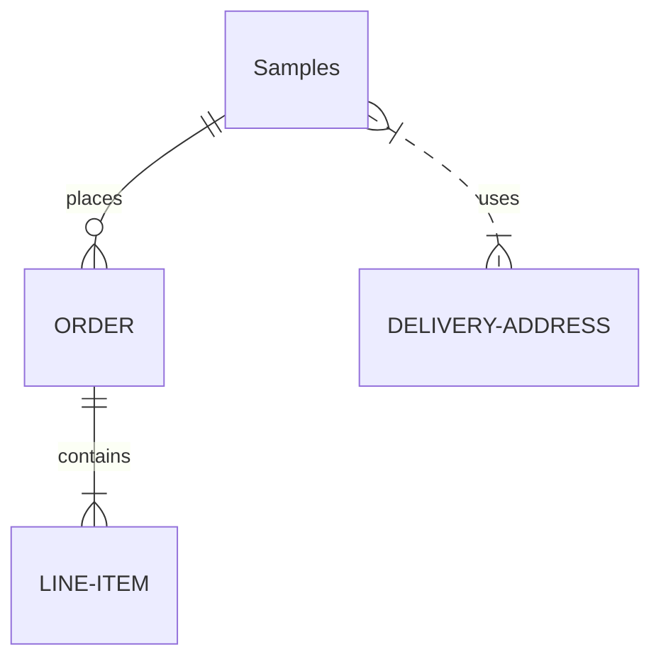

graph TD;
    A([Sample Pool]) --> B(Rarefy seqs @750x50 ) & G(Randomize sample)   
    B --> C(99 samples)
    C --> D
    D --> E
    E --> F
 
    G --> H(136 sample vector)
    H --> I
    I --> J
    J --> K
   

